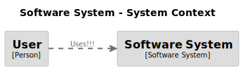

<!-- !<:PROCESS -->

## Example diagrams mixed in documentation

Example of some diagrams rendered by [Kroki](https://kroki.io/) using the
code-blocks collapsed (▶) in the `<details>` tags of this Markdown file. See
this Markdown source `1_mixin_diagram_documentation.md` for diagram code-block
references.

The folder `.code-formation` has a script `diagram.js` that introduces `diagram`
snippet which is used by the code-formation instructions in this Markdown file.
This snippet calls [Kroki](https://kroki.io/) web service to render the diagram
code in the code-blocks.

  
The code-formation instruction sets the `out` to be the same file reference in
the Markdown image tag `` so that the generated diagram image
will be displayed in a Markdown viewer for this file.

At the top of this file Markdown source, there is `!<:PROCESS` instruction for
code-formation to know there is processing needed on this file. It tries to
render every snippet injection, but in contrast to `!<:WRITE` instruction, there
is no need for writing anywhere else.

<!----------------------------------------------------------------------------->

<!-- $[:diagram (src "markdown-code-block") (type "plantuml") (out "./media/plantuml_example.svg") -->

<details>
    <summary>PlantUML example</summary>

```plantuml
skinparam ranksep 20
skinparam dpi 125
skinparam packageTitleAlignment left

rectangle "Main" {
  (main.view)
  (singleton)
}
rectangle "Base" {
  (base.component)
  (component)
  (model)
}
rectangle "<b>main.ts</b>" as main_ts

(component) ..> (base.component)
main_ts ==> (main.view)
(main.view) --> (component)
(main.view) ...> (singleton)
(singleton) ---> (model)
```

</details>
<!-- $] -->


<!----------------------------------------------------------------------------->

<!-- $[:diagram (src "markdown-code-block") (type "mermaid") (out "./media/mermaid_example.svg") -->

<details>
    <summary>Mermaid example</summary>


</details>
<!-- $] -->


<!----------------------------------------------------------------------------->

<!-- $[:diagram (src "markdown-code-block") (type "structurizr") (out "./media/structurizr_example.svg") -->

<details>
    <summary>Structurizr example</summary>

```
workspace {
    model { 
        user = person "User" 
        softwareSystem = softwareSystem "Software System" { 
            webapp = container "Web Application" { 
                user -> this "Uses!!!" 
            } 
            database = container "Database" { 
                webapp -> this "Reads from and writes to" 
            } 
        } 
    } 
    views { 
        systemContext softwareSystem { 
            include * 
            autolayout lr 
        } 
        container softwareSystem { 
            include * 
            autolayout lr 
        } 
        theme default 
    } 
}
```

</details>
<!-- $] -->



<!----------------------------------------------------------------------------->

<!-- $[:diagram (src "markdown-code-block") (type "nomnoml") (out "./media/nomnoml_example.svg") -->

<details>
    <summary>Nomnoml example</summary>

```
[Pirate|eyeCount: Int|raid();pillage()|
  [beard]--[parrot]
  [beard]-:>[foul mouth]
]

[<abstract>Marauder]<:--[Pirate]
[Pirate]- 0..7[mischief]
[jollyness]->[Pirate]
[jollyness]->[rum]
[jollyness]->[singing]
[Pirate]-> *[rum|tastiness: Int|swig()]
[Pirate]->[singing]
[singing]<->[rum]
```

</details>
<!-- $] -->


<!----------------------------------------------------------------------------->

<!-- $[:diagram (src "markdown-code-block") (type "dbml") (out "./media/dbml_example.svg") -->

<details>
    <summary>DBML example</summary>

```
Table users {
  id integer
  username varchar
  role varchar
  created_at timestamp
}

Table posts {
  id integer [primary key]
  title varchar
  body text [note: 'Content of the post']
  user_id integer
  status post_status
  created_at timestamp
}

Enum post_status {
  draft
  published
  private [note: 'visible via URL only']
}

Ref: posts.user_id > users.id // many-to-one
```

</details>
<!-- $] -->


<!----------------------------------------------------------------------------->
