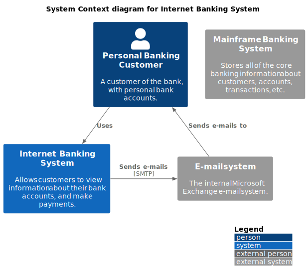

## Example standalone diagram source

The diagram below is scripted in `2_standalone_diagram.plantuml` which has a
`@render` macro expansion for code-formation to render the diagram code using
[Kroki](https://kroki.io/).

The folder `.code-formation` has a script `diagram.js` that introduces `diagram`
snippet which is used by the code-formation instructions in this Markdown file.
This snippet calls [Kroki](https://kroki.io/) web service to render the diagram
code. Along with it is `render.clj` script that includes `render` macro which is 
a shorthand to use repeatedly in standalone diagram scripts.

The code-formation macro instruction sets the `out` to be the same file
reference in the Markdown image tag `` that is written below
in this Markdown file, so the generated diagram image will be displayed in a
Markdown viewer.

